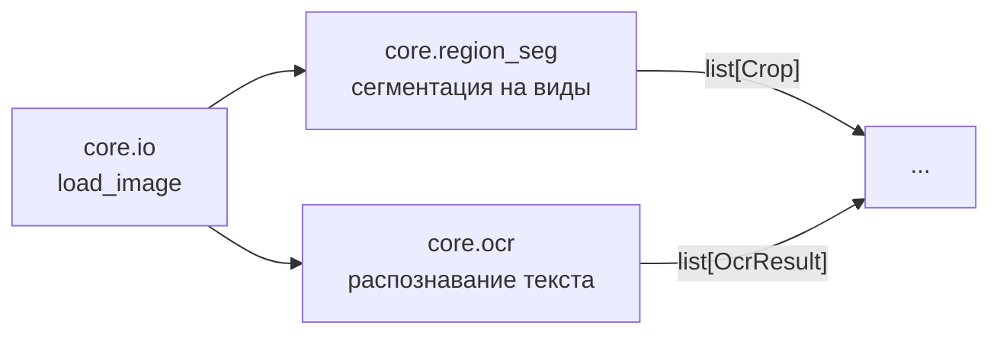

# Архитектура draftslice

Библиотека обработки растровых чертежей: от исходного скана до нарезки на регионы, готовые для
OCR и классификации толщины линий.

## Карта модулей

| Модуль | Роль | Вход | Выход |
|---|---|---|---|
| `core.io` | Загрузка изображения из пути, байтов или готовой матрицы | `str \| bytes \| Mat` | `Mat` |
| `core.region_seg` | Сегментация чертежа на большие сегменты — виды детали | `Mat` (RGB) | `list[Crop]` |
| `core.ocr` | Распознавание текста на чертеже (в т.ч. повёрнутого) через PaddleOCR | `Mat` (RGB) | `list[OcrResult]` |

Подробности каждого модуля — в [`modules/`](modules/), история решений и открытые проблемы —
в [`decisions/`](decisions/).

## Общие примитивы core

Используются несколькими модулями, сами по себе не являются самодостаточным модулем пайплайна:

- `core/types.py` — общие type alias (`Mat`, `Array`, `Array2D`).
- `core/exceptions.py` — `DraftsliceException` и наследники (`DraftsliceValueError`,
  `DraftsliceTypeError`, `DraftsliceRuntimeError`, `ArrayNullError`,
  `DraftsliceFileNotFoundError`) — переопределяют built-in имена внутри пространства имён
  библиотеки; `except DraftsliceException` ловит все ошибки библиотеки разом.
- `core/validators.py` — `validate_image`, декоратор валидации изображений по каналам/dtype.
- `core/utils/image_utils.py` — переиспользуемые примитивы над изображением
  (`rgb_to_grayscale`, `binarize_image`, `dilate_image`, `rotate_image`).
