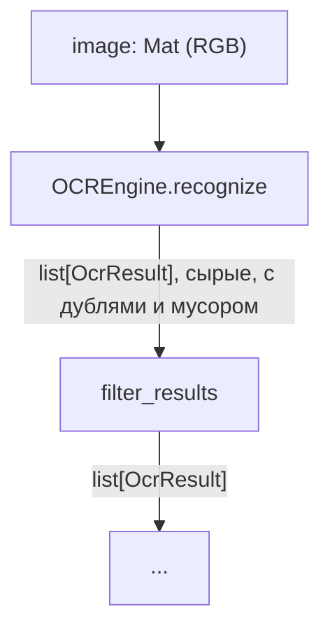

# Модуль: ocr

Распознаёт текст на растровом чертеже (размерные надписи, позиции, технические требования) через
PaddleOCR.

## Пайплайн

| Шаг | Функция | Вход | Выход |
|---|---|---|---|
| 1. Распознавание по поворотам | `OCREngine.recognize` | `Mat` (RGB) | `list[OcrResult]` (сырые) |
| 2. Фильтрация и слияние дублей | `filter_results` | `list[OcrResult]` | `list[OcrResult]` |

`run()` композирует оба шага и возвращает финальный список - без промежуточных сырых результатов.

## Шаг 1. Распознавание на нескольких поворотах листа

Детектор PaddleOCR надёжно находит только текст, близкий к горизонтальному, а на чертеже
размерные надписи часто идут вертикально вдоль размерных линий.

!!! warning "Встроенный `use_textline_orientation` не решает эту задачу"
    В PaddleOCR/PaddleX есть отдельный классификатор ориентации текстовой строки
    (`use_textline_orientation`), но по исходникам paddlex он умеет корректировать только
    0°/180° (`rotate_angle_list` принимает исключительно `0` или `1`, что соответствует `0°`
    или `180°`). Для вертикального (90°/270°) текста он бесполезен - см.
    [решения](../decisions/ocr.md#почему-не-usetextlineorientation).

Вместо этого `OCREngine.recognize` прогоняет полный цикл детекция+распознавание на каждом угле
из `PaddleOCRParameters.angles` (по умолчанию `(0, 90, 270)`) - для каждого поворота лист
поворачивается целиком (`core/utils/image_utils.rotate_image`, холст расширяется под новый
размер), запускается `PaddleOCR.predict`, а найденные `rec_polys` переводятся обратной матрицей
поворота (`cv2.invertAffineTransform`) обратно в систему координат исходного `image` - другие
модули всегда получают `OcrResult.poly` в одной и той же (исходной) системе координат, независимо
от того, на каком повороте текст был найден.

$$
\text{poly}_{\text{original}} = M^{-1} \cdot \text{poly}_{\text{rotated}}
$$

где $M$ - аффинная матрица поворота, построенная для конкретного угла и размера холста.

## Шаг 2. Фильтрация и слияние дублей

Один и тот же текст может быть распознан в нескольких поворотах одновременно (например, если
строка не строго горизонтальна ни в одном из углов, но распознаётся приемлемо в двух). `filter_results`:

1. Отбрасывает результаты, где нет ни одной буквы/цифры (`str.isalnum()`, юникод-корректно
   работает и с кириллицей) - шум детектора на графических элементах чертежа.
2. Убирает дубли между поворотами через NMS (non-max suppression) по IoU осевых прямоугольников
   полигонов: сортирует по `confidence`, жадно оставляет запись, если она не перекрывается больше
   `iou_threshold` с уже оставленной более уверенной.

$$
\text{IoU}(a, b) = \frac{\text{area}(a \cap b)}{\text{area}(a \cup b)}
$$

!!! note "IoU считается по осевому прямоугольнику полигона, не по самому четырёхугольнику"
    Упрощение сознательное - для различения "та же надпись" от "соседняя другая надпись" этого
    достаточно, точное пересечение произвольных четырёхугольников выигрыша не даёт. См.
    [известную проблему](../decisions/ocr.md#iou-по-осевому-прямоугольнику) для пограничного
    случая, где это может быть неточным.

## Граница с другими модулями

`OcrResult` не содержит и не должен содержать ничего о линиях/штрихах чертежа - только
`text`/`confidence`/`poly`. Решение, что считать текстом при работе с линиями (например,
`text_share` цепи скелетона), принимает модуль классификации линий, беря `OcrResult.poly` как
вход - `ocr` о существовании линий ничего не знает.
