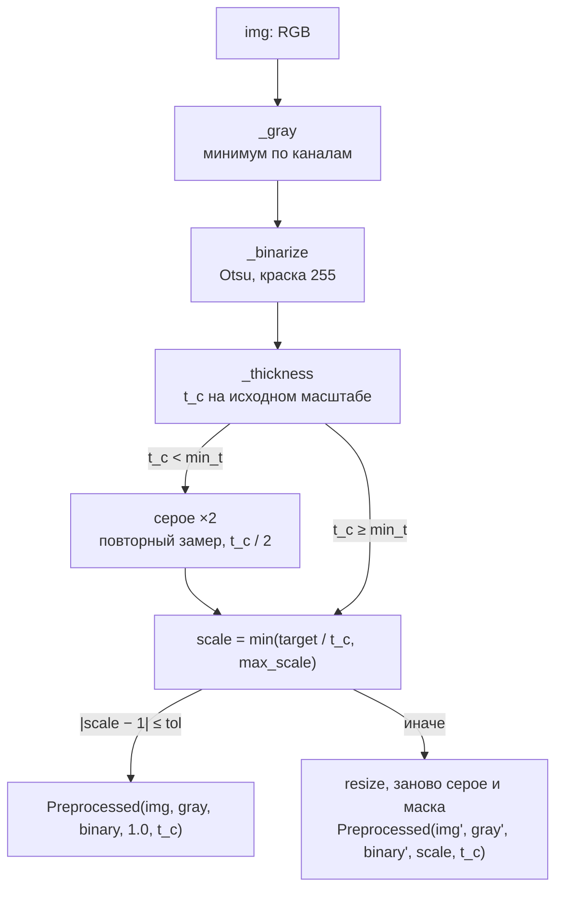

# Модуль: preprocess

Приводит изображение к виду, в котором работают остальные шаги: серое, бинаризация и масштаб, при котором
контур детали имеет одну и ту же толщину на любом листе. Про содержимое чертежа (текст, размеры) модуль
ничего не знает: `_thickness` принимает любую бинарную маску.

## Пайплайн

Единственная публичная функция — `preprocess`. Шаги — приватные: `_gray`, `_binarize`, `_thickness`. Нормализацию
можно выключить (`target=None`): тогда возвращаются серое и маска краски исходного масштаба. Так вызывает
`region_seg`.

## Оценка толщины контура

Толщина в точке скелета $t = 2 \cdot dist$, округлённая до px. На типичном листе у скелета три горки: тонкие линии
(2–3 px), выноски (4 px) и контур (6 px при ×2). Выше контура остаются только наконечники, и они редкие.
Толщина контура — самая толстая из толщин, на которую приходится не меньше `top_share` (6 %) пикселей скелета;
значение — среднее по этой горке.

Запас по `top_share` на 17 листах: контурная горка занимает от 9.1 % (лист 17), самая частая толщина выше контура —
не больше 4.3 % (листы 11 и 12). Порог 6 % лежит между ними.

Замер на 17 листах совпал с эталоном (медиана толщины контура по графу линий `thick_lines`, пересчитанная на
исходный масштаб) в пределах шага квантования:

| листы | эталон, px | оценка, px |
|---|---|---|
| 1–7, 9, 10, 15–17 | 3.0 | 3.0 |
| 11, 12 | 2.0 | 2.0 |
| 19 | 3.8 | 4.0 |
| 8 | 9.6 | 10.0 |
| 18 | 10.6 | 12.0 |

!!! warning "Нечётная ширина штриха"
    Расстояние до фона дискретно: у штриха нечётной ширины $w$ значение $2 \cdot dist$ равно $w + 1$, у чётной
    ширины — $w$. Поэтому на тонком контуре (3 px) замер по исходной маске даёт 4 px, и `preprocess`
    повторяет замер на увеличенном вдвое изображении, где контур 6 px чётный.

## Масштаб

$$scale = \min\left(\frac{target}{t_c},\ max\_scale\right), \qquad |scale - 1| \le tol \;\Rightarrow\; scale = 1$$

На листах 1–7, 9, 10, 15–17 получается ×2.0, на 11 и 12 ×2.93, на 19 ×1.49, на 8 ×0.6, на 18 ×0.5 (исходные размеры
листов — от 1085 до 5109 px по ширине).

Увеличение — `INTER_LINEAR_EXACT`, уменьшение — `INTER_AREA`.

!!! note "Масштаб нужен только для анализа"
    Очищенное изображение сохраняет исходный масштаб (SCALE-01). Поэтому `Preprocessed.scale` возвращается
    вызывающему, а маска удаления из нормализованного масштаба переносится обратно на исходные пиксели.
