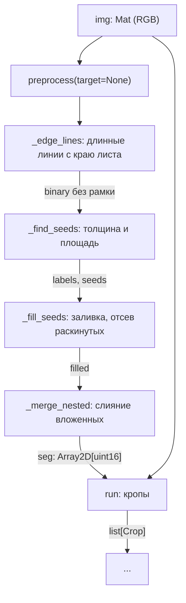

# Модуль: region_seg

Сегментирует растровый чертёж на большие сегменты — виды детали — и возвращает кроп каждого
вида. Мелочь (текст, размеры, сноски) в результат не попадает. Прежний алгоритм лежит в
`region_seg/legacy/` и не используется.

## Пайплайн

| Шаг | Функция | Вход | Выход |
|---|---|---|---|
| 1. Бинаризация | `preprocess` (`core.preprocess`) | `Mat` (RGB) | `Mat` (0/255) |
| 2. Линии листа | `_edge_lines` | `Mat` | маска краевых линий |
| 3. Seed'ы | `_find_seeds` | `Mat` | карта компонент, метки seed'ов |
| 4. Заливка | `_fill_seeds` | карта, seed'ы | `Mat` (0/1) |
| 5. Вложенность | `_merge_nested` | `Mat` | `Array2D[uint16]` |
| 6. Кропы | `run` | `Mat`, карта | `list[Crop]` |

Шаги 1–5 — `seg.segment()`, шаг 6 — `pipeline.run()`.

## Шаг 1. Серый — минимум по каналам

`preprocess` берёт серое минимумом по каналам, а не яркостью. Бумага — 255 во всех каналах, у любой
цветной или тёмной линии хотя бы один канал низкий. По яркости светлая цветная осевая уходит за
порог Otsu в фон и рвёт контур в месте пересечения.

## Шаг 2. Длинные линии с краю листа

Открытие ядром $\lfloor c \cdot W \rfloor \times 1$ и $1 \times \lfloor c \cdot H \rfloor$, где
$c$ — `sheet_cov`, оставляет длинные прямые отрезки. Отрезок удаляется, только если между ним и
краем листа в его колонках (строках) нет содержимого дальше собственной толщины линии. Удаляются
пикселы линии, а не компонента: вид, чьи выносные касаются рамки, остаётся целым, а длинная
размерная линия внутри чертежа не трогается.

## Шаг 3. Seed'ы

Для компоненты с bbox $w \times h$ и площадью краски $A$ толщина $t = \min(w, h)$:

$$
\text{seed} = \left(t > k_t \cdot \bar{t}\right) \land \left(A > k_A \cdot \bar{A}\right) \land \lnot\,\text{frame}
$$

$\bar{t}$ и $\bar{A}$ — средние толщина и площадь компонент листа, $k_t$ — `thick_factor`,
$k_A$ — `area_factor`. Толщина отсекает длинные слитные слова (их $t$ — высота шрифта) и длинные
тонкие линии, площадь — крупные одиночные буквы. Рамка — bbox не меньше $c$ листа по обеим осям.

## Шаг 4. Заливка

Внешние контуры seed'ов заливаются: всё внутри вида — отверстия, штриховка, надписи поверх —
попадает в его сегмент. Контур остаётся, если доля бокса под заливкой больше `min_extent`: вид
после заливки сплошной, сноска с длинными выносками — нет.

## Шаг 5. Слияние вложенных

Для пары сегментов доля бокса $i$ внутри бокса $j$:

$$
\text{inside}_{ij} = \frac{|B_i \cap B_j|}{|B_i|}
$$

Меньший сегмент сливается с тем, в чей бокс он входит больше чем на `inside`. Не IoU: у
вложенного бокса IoU не превышает отношения площадей. После слияния большие сегменты
зафиксированы и между собой не объединяются.

## Шаг 6. Кропы и память

`Crop` хранит бокс по собственной границе сегмента, маску сегмента в боксе и срез исходного
изображения — вид numpy без копии. `Crop.img` собирает очищенный кроп (пикселы сегмента как в
исходнике, остальное белое) только при обращении. На весь лист в памяти остаётся исходное
изображение и маски размером с боксы видов.

## Сквозные конвенции

- Метки 1-based, `0` — фон. Карта сегментов `uint16`, номера после слияния идут с пропусками.
- Параметры — аргументы `run()` с умолчаниями, общий конфиг пайплайна передаёт их позже.
