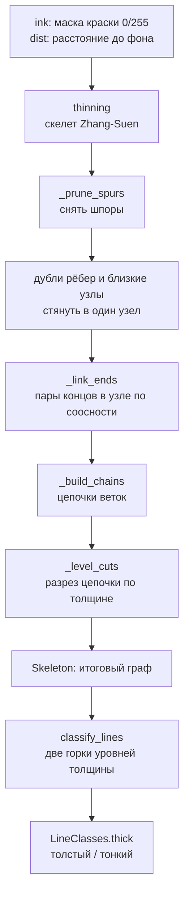

# Модуль: thick_lines

Из маски краски чертежа строит граф линий и делит линии на толстые (контур детали) и тонкие (размерные,
выносные, штриховка, рамки с номерами). Нужен, чтобы оставить контур и не повредить его.

## Пайплайн



| Шаг | Функция | Вход | Выход |
|---|---|---|---|
| 1. Граф линий | `build_graph` | маска краски, `dist` | `Skeleton` (итоговый граф) |
| 2. Классы толщины | `classify_lines` | граф, `dist` | `LineClasses` |

`build_graph` склеивает ветки по соосности и режет их по толщине внутри себя, поэтому дальше граф
используется как есть. `classify_lines` только читает граф и ничего в нём не меняет.

## Условности

- Координаты — `(row, col)`. Путь графа — последовательность пикселей скелета от одного конца к другому.
- **Толщина** $t = 2 \cdot dist$ — диаметр вписанного круга в точке скелета. Она квантована: $dist$ у
  cv2 на линиях вдоль сетки целый, поэтому на исходном масштабе $t$ идёт шагом 2 px (на листах 1, 10 и 19
  уровни линий 2 и 4). Лист увеличивают до бинаризации, см. [масштаб](../decisions/thick_lines.md).
- **Уровень линии** — среднее геометрическое её толщины без пятен стыков:

    $$level = \exp\left(\overline{\ln t}\right)$$

    Толщина мультипликативна (линия в два раза толще, а не на 2 px), поэтому все пороги работают с отношениями.
- Соседние куски одной линии делят крайний пиксель.
- Все длины и толщины — в пикселях рабочего изображения, после увеличения.

## Шаг 1. Скелет и снятие шпор

Скелет Zhang–Suen даёт в пятне стыка короткие тупики: у широкого пересечения, у конца толстой линии.
Ветка, у которой один конец свободный, другой в узле, а длина не больше толщины в узле, — шпора пятна, а не
линия. Её снимают, пока что-то снимается: после снятия узел может стать проходным.

```text
до                          после
  ────────┬────────           ───────────────────
          ╵
        шпора: свободный конец, длина ≤ толщины в узле
```

## Шаг 2. Дубли и близкие узлы

- **Ребро-дубль** — ветка из двух точек между узлами, параллельная другой ветке с теми же концами
  (ступенька скелета на диагонали). Убирается.
- **Близкие узлы** — стык, распавшийся на несколько узлов: ветка между двумя узлами короче суммы радиусов
  их пятен ($dist$ в узлах). Узлы и ветка стягиваются в один узел.

После каждой правки skan пересобирает ветки.

## Шаг 3. Склейка по соосности

В каждом узле концы веток объединяются в пары, каждый конец входит не больше чем в одну пару. Порядок:

1. дуги одной окружности (их центры и радиусы совпадают в пределах `tol` радиуса) — первыми;
2. соосные концы по возрастанию излома, но не больше `max_kink_deg`.

Толщина при склейке не учитывается. Короткий тупик (свободный конец, длина не больше толщины в узле)
направление не держит и в пары не входит: он не должен перехватывать пару у настоящей линии.

```text
  A ──────────┬────────── B     A и B: излом ≈ 0° ≤ max_kink_deg → одна линия A–B
              │
              C                 C: излом 90° → остаётся отдельной веткой
```

Склеенные ветки образуют цепочку, цепочка — один путь графа до следующего шага.

## Шаг 4. Разрез по толщине

Цепочка может быть линией со сменой толщины без узла: толстый контур переходит в тонкую выноску, клин
наконечника стоит на конце размерной линии. Профиль $t$ вдоль цепочки сначала очищается от **пятен
стыков**: вокруг каждого узла (степень ≥ 3) на $\lceil t/2 \rceil$ точек в обе стороны значения заменяются
интерполяцией по соседям вне пятен — там скелет меряет стык, а не линию.

Дальше бинарное разбиение по логарифму толщины. Для разреза перед точкой $i$ в профиле из $n$ точек:

$$\Delta_i = \left|\overline{\ln t}_{[0,i)} - \overline{\ln t}_{[i,n)}\right|, \qquad
i^* = \arg\max_i \sqrt{\tfrac{i\,(n-i)}{n}}\;\Delta_i$$

Разрез в $i^*$ принимается, если $\Delta_{i^*} > \ln r$, где $r$ — **`thick_ratio`** (единственный порог по
толщине), а обе части не короче $3$ толщин линии. Каждая часть режется дальше тем же правилом. Ниже порога
линия остаётся одной, выше — режется.

```text
контур  ═════════════════════──────────────────
t       6 6 6 6 6 6 6 6 6 6 6  2 2 2 2 2 2 2 2 2
                              ▲
                  отношение 3 > thick_ratio → две линии: толстая и тонкая
```

**Клин наконечника.** Если клин не короче 3 толщин линии и его средняя толщина больше чем в
`thick_ratio` раз средней толщины остальной линии, он может стать отдельным куском. Границу куска задаёт
лучший разрез по формуле выше, а не начало клина:

```text
размерная   ─────────────────────────────────▶
t           2 2 2 2 2 2 2 2 2 2 2 2 2 2 2 4 6 8 7 4
                                            └ клин ┘ → отдельный кусок
```

**Короткий горб остаётся в линии.** Горб короче 3 толщин почти не меняет среднюю толщину ни одной из двух
частей любого разреза, и разрез не проходит порог. Типичный случай — линия, пересекающая дугу: между двумя
близкими узлами скелет меряет краску дуги, а не линии.

```text
линия   ────────────●══●────────────────
t       2 2 2 2 2 2 7 7 2 2 2 2 2 2 2 2          горб в 2 точки между двумя узлами:
                    └┘                           не разрезается, уровень линии остаётся 2
```

Для разбора, почему линия не разделилась, см. ячейку `show_line` в блокноте `exp_clear_drawing`: она
показывает профиль $t$, уровень линии, полосу $\pm$ `thick_ratio` и лучший возможный разрез с его отношением.

## Шаг 5. Классы толщины

Уровни линий графа образуют распределение с весом по длине линии. Линии одного класса дают горку,
поэтому порог ищется между горками, а не по Otsu: порог Otsu зависит от соотношения масс классов и от шума
(рукописный лист), порог в долине — нет.

1. Плотность логарифма уровня оценивается гауссовым ядром шириной `bandwidth` (по умолчанию 0.066:
   горки ближе $e^{4 \cdot 0.066} \approx 1.3$ раз сливаются в одну).
2. Горки — максимумы плотности. **Масса горки** — доля длины между соседними долинами. Значимые горки —
   с массой не меньше `min_mass` (0.05).
3. **Толстая горка** — верхняя из двух самых массивных значимых. Всё ниже неё (включая промежуточные
   горки, например выноски) тонкое.
4. **Порог** — минимум плотности между толстой горкой и ближайшей значимой горкой под ней, умноженный на
   `thr_scale` (по умолчанию 1). Линия толстая, если её уровень выше порога.
5. Если значимая горка одна, класс один: толстых нет.

```text
доля длины
 │ █
 │ █                          ▄
 │ █▃       ▄                 █▃
 └─┴─┴───────┴────┬────────────┴───────▶ уровень, px
   2.3        4.0  порог 4.7   5.7
   тонкие     выноски         контур: толстая горка
```

Пример взят с листа 7 (масштаб 1.7): горки 2.3 (штриховка, размерные), 4.0 (выноски) и 5.7 (контур). Порог
между 4.0 и 5.7, а не между 2.3 и 5.7, иначе выноски уйдут в толстые.

`resolved` показывает, что классов два и отношение центров горок больше отдельного `thick_ratio`
классификатора. Он не связан с `thick_ratio` графа и может быть выключен (`None`).